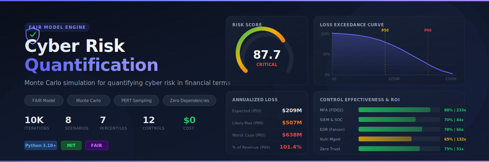

<p align="center">
  
</p>

<p align="center">
  <a href="https://www.python.org/"></a>
  <a href="LICENSE"></a>
  <a href="https://www.fairinstitute.org/"></a>
</p>

## Overview

The CRQ Engine implements the **FAIR (Factor Analysis of Information Risk)** model to quantify cyber risk scenarios using Monte Carlo simulation. It translates technical risk into **financial impact** — annualized loss expectancy (ALE) with percentile distributions, loss exceedance curves, and control effectiveness analysis.

### Key Features

- **FAIR Model** — Full taxonomy: TEF → Vulnerability → LEF × Loss Magnitude
- **Monte Carlo Simulation** — 10,000 iterations per scenario (configurable) with PERT distribution sampling
- **Risk Scoring** — Log-scale 0–100 risk score normalized against organization revenue
- **Loss Exceedance Curves** — Probability of exceeding given loss thresholds
- **Control Analysis** — Cost-effectiveness and ROI for each security control
- **Multiple Reports** — Colored console, structured JSON, HTML dashboard with SVG charts
- **Zero Dependencies** — Pure Python standard library, no pip install required

## FAIR Model

```
Risk = LEF × LM
├── LEF (Loss Event Frequency)
│   ├── TEF = Contact Frequency × Probability of Action
│   └── Vulnerability = f(Threat Capability, Resistance Strength)
└── LM (Loss Magnitude)
    ├── Primary: Productivity + Response + Replacement
    └── Secondary: Fines + Reputation + Competitive Advantage
```

All inputs use **min / likely / max** ranges, sampled via PERT (beta) distribution for realistic uncertainty modeling.

## Quick Start

```bash
# Run with sample scenarios (console report)
python crq_engine.py sample_scenarios.json

# Generate JSON + HTML reports
python crq_engine.py sample_scenarios.json --json report.json --html dashboard.html

# Filter to HIGH+ severity only
python crq_engine.py sample_scenarios.json --severity HIGH

# Custom simulation count with seed for reproducibility
python crq_engine.py sample_scenarios.json --simulations 50000 --seed 42

# Verbose mode
python crq_engine.py sample_scenarios.json -v
```

## CLI Options

| Option | Description | Default |
|--------|-------------|---------|
| `scenarios` | Path to scenarios JSON file | (required) |
| `--json FILE` | Save structured JSON report | — |
| `--html FILE` | Save HTML dashboard with SVG charts | — |
| `--severity LEVEL` | Minimum severity: CRITICAL, HIGH, MEDIUM, LOW | all |
| `--simulations N` | Monte Carlo iterations per scenario | 10,000 |
| `--seed N` | Random seed for reproducibility | — |
| `-v, --verbose` | Verbose output with timing | — |
| `--version` | Show version | — |

## Scenario JSON Format

```json
{
  "organization": {
    "name": "Acme Corp",
    "revenue": 500000000,
    "employees": 5000,
    "industry": "financial_services"
  },
  "assets": [
    {
      "id": "asset-001",
      "name": "Customer PII Database",
      "type": "data",
      "records": 2000000,
      "value": { "min": 5000000, "likely": 15000000, "max": 50000000 }
    }
  ],
  "controls": [
    {
      "id": "ctrl-001",
      "name": "EDR",
      "category": "detective",
      "effectiveness": { "min": 65, "likely": 78, "max": 92 },
      "annual_cost": 280000,
      "applies_to": ["scenario-001"]
    }
  ],
  "scenarios": [
    {
      "id": "scenario-001",
      "name": "Ransomware Attack",
      "threat_community": "organized_crime",
      "contact_frequency": { "min": 12, "likely": 52, "max": 365 },
      "probability_of_action": { "min": 0.05, "likely": 0.15, "max": 0.35 },
      "threat_capability": { "min": 60, "likely": 75, "max": 90 },
      "resistance_strength": { "min": 45, "likely": 62, "max": 78 },
      "primary_loss": {
        "productivity": { "min": 500000, "likely": 2000000, "max": 8000000 },
        "response": { "min": 300000, "likely": 1500000, "max": 5000000 },
        "replacement": { "min": 100000, "likely": 500000, "max": 2000000 }
      },
      "secondary_loss": {
        "fines": { "min": 100000, "likely": 2000000, "max": 10000000 },
        "reputation": { "min": 500000, "likely": 3000000, "max": 15000000 },
        "competitive_advantage": { "min": 0, "likely": 500000, "max": 3000000 }
      }
    }
  ]
}
```

## Reports

### Console Report
Colored terminal output with risk gauges, ALE percentile tables, severity distribution, and control effectiveness ranking.

### JSON Report (`--json`)
Full structured output with simulation results, percentiles, loss exceedance data, and control analysis — suitable for integration with dashboards and SIEM platforms.

### HTML Dashboard (`--html`)
Dark-themed interactive dashboard with:
- **Risk Score Gauge** — Donut chart showing peak risk score
- **Risk Heatmap** — Likelihood × Impact grid with scenario positions
- **Loss Exceedance Curve** — Aggregate probability of exceeding loss thresholds
- **Control Effectiveness** — Horizontal bar chart with ROI indicators
- **Scenario Cards** — Per-scenario ALE distribution and loss breakdown

## Sample Scenarios

The included `sample_scenarios.json` models 8 risk scenarios for a financial services company:

| # | Scenario | Threat | Severity |
|---|----------|--------|----------|
| 1 | Ransomware Attack | Organized Crime | HIGH–CRITICAL |
| 2 | Data Breach (Nation-State APT) | Nation State | HIGH–CRITICAL |
| 3 | Cloud Misconfiguration | Accidental Insider | LOW–MEDIUM |
| 4 | Supply Chain Compromise | Nation State | HIGH |
| 5 | Malicious Insider Threat | Malicious Insider | MEDIUM–HIGH |
| 6 | DDoS Attack | Hacktivist | LOW–MEDIUM |
| 7 | API Exploit (Open Banking) | Organized Crime | MEDIUM–HIGH |
| 8 | Business Email Compromise | Organized Crime | LOW–MEDIUM |

## Exit Codes

| Code | Meaning |
|------|---------|
| 0 | No CRITICAL or HIGH risk scenarios |
| 1 | One or more CRITICAL or HIGH risk scenarios |
| 2 | Input error (file not found, invalid JSON) |

## Version

**v1.0.0** — Initial release

## License

MIT — see [LICENSE](LICENSE) for details.
